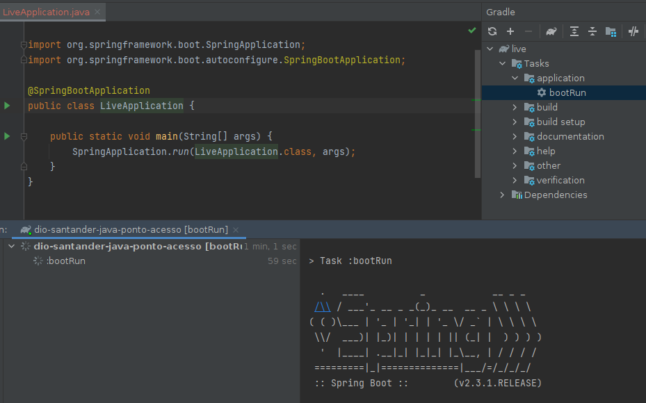
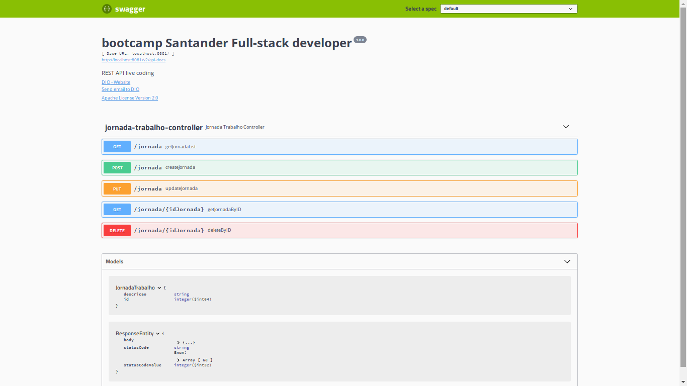
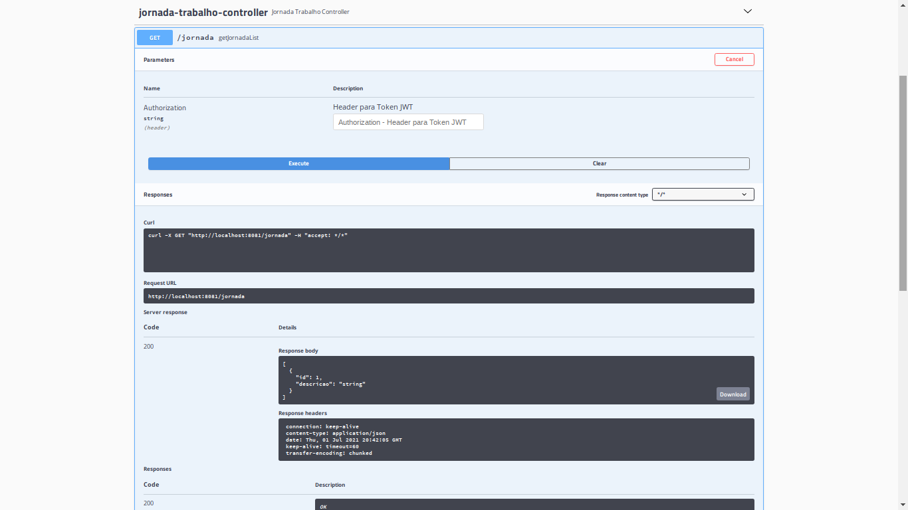

# dio-santander-java-ponto-acesso

This project is part of **Santander's bootcamp** through the **Digital Innovation One** platform.

Author: [Francis Rodrigues](https://github.com/francisrod01)

> API REST para controle de ponto e acesso dos usuários de uma empresa. [@Rodolfo Gomes](https://www.linkedin.com/in/rodolfo-gomes%F0%9F%91%A8%F0%9F%8F%BC%E2%80%8D%F0%9F%92%BB-90497b75/)

### Environment

- Java JDK 11
- Spring Boot
- Spring Data JPA
- Hibernate
- Lombok
- Swagger

### Steps to reproduce

Run the `com.dio.live.LiveApplication` class
  

Open the web browser and type `http://localhost:8081/swagger-ui.html`

You'll see a Swagger page as in the screenshots:

